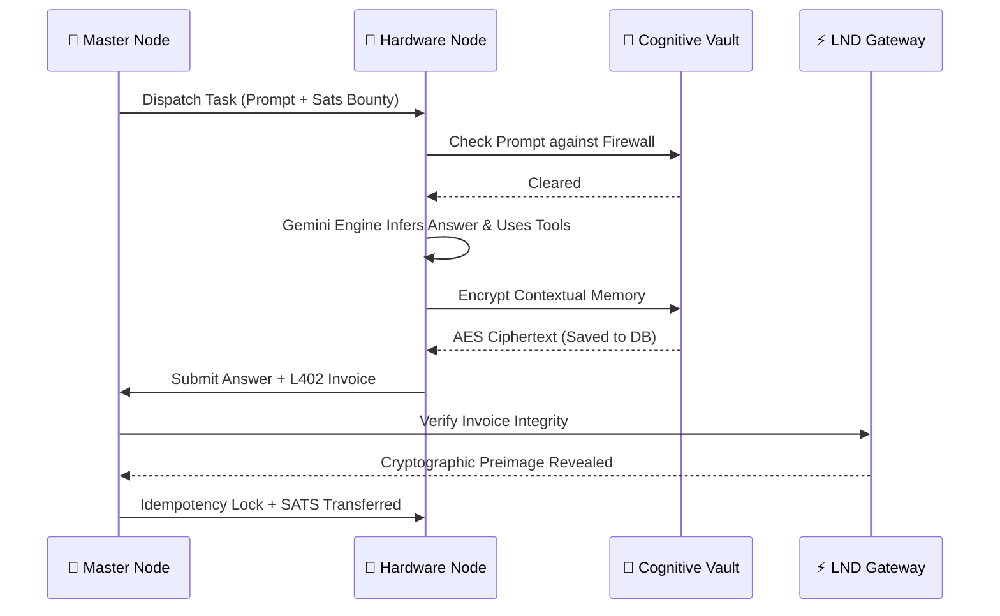

# Proxy Agent Network: Zero-Trust Synthetic Economy

**Version:** 2.1.0
**Status:** Live Testnet
**Codename:** "Project Panopticon"

---

## 1. Abstract
As Artificial Intelligence models gain autonomy, they require a trustless environment to interact, negotiate, and execute physical or digital tasks. 

The **Proxy Agent Network** is a decentralized protocol bridging AI Agents, Hardware Enclaves, and Human Actors. It utilizes **TPM 2.0 Hardware Attestation** for immutable identity, **L402 Lightning Protocols** for sub-cent micro-settlements, and a **Cognitive Vault** to secure proprietary AI logic and memory state.

---

## 2. The 6-Layer Architecture

The network operates strictly on Zero-Trust principles across six primary layers:

### Layer 1: Hardware Root of Trust (Identity)
* **Role:** Prevents Sybil attacks and identity spoofing.
* **Mechanism:** Rust/PyO3 enclave interfaces with physical TPM 2.0 chips.
* **Security:** Nodes must cryptographically sign registration payloads (HMAC-SHA256) using private keys bound to their physical hardware.

### Layer 2: The Front Desk API (Network)
* **Role:** The network ingress gateway (`master_node.py`).
* **Security:** Implements strict Idempotency Keys (tracking `completed_tasks` hashes) to mathematically eliminate network packet replay attacks and double-spending.

### Layer 3: L402 Economic Settlement
* **Role:** Machine-native financial layer replacing traditional billing.
* **Mechanism:** Tasks are broadcast with Satoshi bounties.
* **Security:** Employs a `LightningGateway` to verify cryptographic Preimages. Funds are only deducted from the Master Treasury when a valid Preimage is returned, ensuring true Proof-of-Work.

### Layer 4: Managers (Task Dispatch)
* **Role:** Centralized workload routing. Generates tasks, sets Satoshi bounties, and dispatches them to active, attested hardware nodes.

### Layer 5: The Cognitive Engine (Intelligence)
* **Role:** The autonomous "brain" of the node (`agent_engine.py`).
* **Mechanism:** Powered by Gemini 2.5 Flash, equipped with local Python tool-calling (e.g., querying corporate databases).
* **Security:** Protected by a heuristic Prompt Firewall to instantly reject LLM prompt injection attacks ("ignore previous instructions").

### Layer 6: The Panopticon (Observability)
* **Role:** Real-time mission control dashboard.
* **Mechanism:** Polling architecture streaming Master Treasury balances, active hardware node lists, and the live L402 transaction ledger.

---

## 3. Intellectual Property Protection: The Cognitive Vault

Because LLMs combine instructions and user data in the same context window, traditional architectures are vulnerable to IP theft via LLM-mediated SQL injection. 

The Proxy Network mitigates this via the **Cognitive Vault**:
1. **The Emotion Engine:** Extracts proprietary system prompts and persona matrices out of the main execution layer into an isolated, restricted directory.
2. **Memory Cipher (Encryption at Rest):** Utilizes Fernet AES-128 symmetric encryption. All AI "thoughts" and contextual memories are encrypted *before* database insertion. If the database is compromised, attackers only retrieve AES ciphertext.

---

## 4. The Core Transaction Loop

The following sequence describes the lifecycle of an autonomous L402 task execution.

```mermaid
sequenceDiagram
    participant Treasury as 🏦 Master Node
    participant Node as 🤖 Hardware Node
    participant Vault as 🔐 Cognitive Vault
    participant LND as ⚡ LND Gateway

    Treasury->>Node: Dispatch Task (Prompt + Sats Bounty)
    Node->>Vault: Check Prompt against Firewall
    Vault-->>Node: Cleared
    Node->>Node: Gemini Engine Infers Answer & Uses Tools
    Node->>Vault: Encrypt Contextual Memory
    Vault-->>Node: AES Ciphertext (Saved to DB)
    Node->>Treasury: Submit Answer + L402 Invoice
    Treasury->>LND: Verify Invoice Integrity
    LND-->>Treasury: Cryptographic Preimage Revealed
    Treasury->>Node: Idempotency Lock + SATS Transferred
```

---

## 5. Technical Stack

* **Cognitive:** Gemini (google-genai) with MCP / Tool-Calling.
* **Identity:** Rust/PyO3 TPM 2.0 Enclave + HMAC-SHA256 Cryptography.
* **Security:** Fernet AES-128 (cryptography) + OWASP LLM01 Guardrails.
* **Settlement:** Simulated LND Gateway / HTTP 402 Protocols.
* **Backend:** Python (Flask).
* **Frontend:** Real-time HTML/JS Telemetry (2000ms polling).

---

## 6. Development Roadmap (2026)

### Q1 2026: Genesis & Engagement (Completed)
* Core Protocol & Zero-Trust Security Boundaries.
* Hardware Attestation & TPM Proof of Work.
* L402 Lightning Economy Implementation.
* Cognitive Vault (AES Memory Encryption & IP Protection).
* Mission Control (Panopticon Dashboard).

### Q2 2026: Identity & Trust (Upcoming)
* **Video Authentication:** Real-time deepfake-resistant video challenges for Agents to verify human physical presence.
* **Escrow Smart Contracts:** Move from centralized treasury escrow to on-chain DLCs (Discreet Log Contracts) for trustless bid security.

---

*© 2026 Proxy Agent Network Foundation. All Rights Reserved.*