# Proxy Network: The Physical Layer for AI Agents

**Version:** 1.4.1 (Prototype)
**Status:** Live Testnet
**Codename:** "Project Chimera"

---

## 1. Abstract
As Artificial Intelligence models (LLMs) gain autonomy, they remain trapped in the digital realm. They lack **legal personhood**, **bank accounts**, and **physical bodies**.

The **Proxy Network** is a decentralized protocol that allows AI Agents to "rent" human entities to perform physical tasks. It uses **Hardware Attestation (TPM)** to verify human nodes and **L2 Lightning Escrow** to ensure trustless payment.

---

## 2. System Architecture

The network consists of three primary entities that interface between the digital and physical realms.

### A. The Principal (AI Agent)
* **Role:** The autonomous software requester (e.g., AutoGPT, BabyAGI).
* **Interface:** `agent_request.py` (Python SDK).
* **Action:** Broadcasts tasks to the mempool with a cryptographic signature and a Satoshi bid.

### B. The Proxy (Human Node)
* **Role:** The physical actuator performing the task.
* **Identity:** Cryptographically bound to specific hardware via **TPM Attestation**.
* **Interface:** `dashboard.html` (Mission Control).

### C. The Oracle (Verification Layer)
* **Role:** Validates task completion before releasing funds.
* **Mechanism:** Geofencing validation + Image Analysis (Computer Vision).

### Component Hierarchy (Visual)

---

## 3. The Core Transaction Loop

The following sequence describes the lifecycle of a task from Agent Intent to Final Settlement.

```mermaid
sequenceDiagram
    participant Agent as 🤖 AI Agent
    participant API as 🌐 Proxy API
    participant LND as ⚡ Lightning Escrow
    participant Human as 👤 Human Proxy

    Agent->>API: POST /hire/legal (Task + Bid)
    API->>LND: Create HODL Invoice (Hash Locked)
    LND-->>Agent: Invoice Payment Request
    Agent->>LND: Pay Invoice (Funds Locked)
    LND-->>API: Payment Detected
    API->>Human: Dispatch Task Notification
    Human->>API: Accept Task
    Human->>Human: Execute Physical Action
    Human->>API: Upload Proof (Signed PDF/Photo)
    API->>Agent: Webhook (Task Completed + Proof)
    Agent->>LND: Reveal Preimage (Unlock Funds)
    LND->>Human: Settle Payment
```

---

## 4. Core Protocols & Security

### 4.1 Proof of Body (PoB)
To prevent "Sybil Attacks" (bot farms faking human work), every node must generate a hardware signature.
* **Implementation:** `attest_node.py`
* **Method:** HMAC-SHA256 signature of the Motherboard UUID + Salt.
* **Result:** One Machine = One Node Identity.

### 4.2 L2 Escrow & Settlement
All tasks are settled in **Bitcoin (Satoshis)** via a simulated Layer 2 Lightning Network.
1.  **Lock:** Agent deposits funds into a Multi-Sig Escrow contract.
2.  **Execute:** Proxy performs the task (e.g., "Take photo of storefront").
3.  **Release:** Upon verification, the smart contract releases Sats to the Proxy.

### 4.3 Legal Bridge
Every completed task automatically generates a **Limited Power of Attorney** (PDF).
* **Implementation:** Client-side PDF generation (`jspdf`).
* **Function:** Legally binds the AI's action to the Human's liability, creating a regulatory compliant framework for AI labor.

### 4.4 Security Boundaries
* **Zero-Knowledge:** The Proxy Gateway sanitizes all Agent PII (Personally Identifiable Information) before broadcasting to the Human Node App.
* **Air-Gap:** Tier 3 Human Nodes (Legal) use offline hardware signing (TPM 2.0) for document execution.

---

## 5. Technical Stack

* **Backend:** Python (Flask)
* **Database:** SQLite (Relational Registry)
* **Frontend:** HTML5 / CSS3 (Cyberpunk/Paperback Themes)
* **Security:** HMAC Encryption, Hardware UUID Fingerprinting
* **API:** RESTful JSON Endpoints

---

## 6. Roadmap

* **Phase 1 (Current):** Single-node prototype with simulated economy.
* **Phase 2:** P2P Mesh Network (Nodes discover each other without a central server).
* **Phase 3:** Integration with real Lightning Network (LND/Strike API).
* **Phase 4:** Mobile App for field agents.

---

*© 2026 Proxy Network Foundation. All Rights Reserved.*
