```mermaid
sequenceDiagram
    participant Agent as 🤖 AI Agent
    participant API as 🌐 Proxy API
    participant LND as ⚡ Lightning Escrow
    participant Human as 👤 Human Proxy

    Agent->>API: POST /hire/legal (Task + Bid)
    API->>LND: Create HODL Invoice (Hash Locked)
    LND-->>Agent: Invoice Payment Request
    Agent->>LND: Pay Invoice (Funds Locked)
    LND-->>API: Payment Detected
    API->>Human: Dispatch Task Notification
    Human->>API: Accept Task
    Human->>Human: Execute Physical Action
    Human->>API: Upload Proof (Signed PDF/Photo)
    API->>Agent: Webhook (Task Completed + Proof)
    Agent->>LND: Reveal Preimage (Unlock Funds)
    LND->>Human: Settle Payment
```

# System Architecture

This document outlines the high-level data flow and settlement logic of the Proxy Protocol.

---

## 1. The Core Transaction Loop
The following sequence describes the lifecycle of a task from Agent Intent to Settlement.

---

## 2. Component Hierarchy
How the Protocol interfaces with the physical world.

---

## 3. Security Boundaries

* **Zero-Knowledge:** The Proxy Gateway sanitizes all Agent PII (Personally Identifiable Information) before broadcasting to the Human Node App.
* **Air-Gap:** Tier 3 Human Nodes (Legal) use offline hardware signing (TPM 2.0) for document execution.
